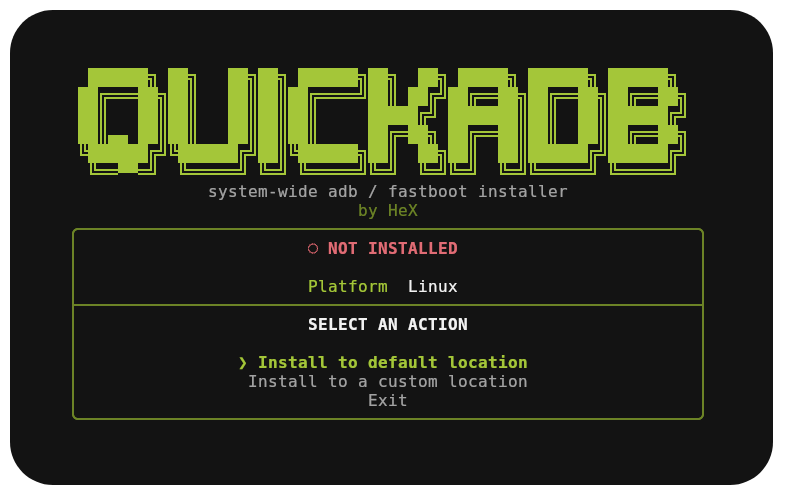

<p align="center">
  
</p>

<h1 align="center">Quick ADB</h1>

<p align="center">
  <b>One command. Full-screen TUI. Fresh <code>adb</code> & <code>fastboot</code> — system-wide.</b>
  <br/>
  A friendly cross-platform installer for Google's official <b>platform-tools</b> package.
</p>

<p align="center">
  
  
  
  
</p>

---

## ✨ What is this?

If you've ever needed `adb` and just wanted it to *work*, you know the drill: find the
right download on Google's site, unzip it somewhere, figure out where "somewhere" should
be, then wrestle your PATH into recognizing it. Ten minutes later you're still not sure
if it actually worked.

**Quick ADB** skips all of that. Point it at your machine and it handles the whole thing:

- 📥 Grabs the **latest official platform-tools** straight from Google — no mirrors, no stale zips
- 🛠️ Installs `adb` + `fastboot` **system-wide**, so they run from any terminal, any folder
- 🧭 Wires up your **PATH** automatically — no manual editing
- ✅ **Verifies** the install actually works before calling it done
- 🔄 Handles updates, uninstalls, and status checks just as easily as the first install
- 🎛️ All of it lives behind a clean, keyboard-driven **full-screen terminal UI** — no flags to memorize, no docs to consult mid-install

It's a single Python file with zero third-party dependencies, so there's nothing extra
to trust or install beyond Python itself.

## 🚀 Getting started

### Prerequisites

| Requirement | Notes |
| --- | --- |
| **Python 3** | Any recent version works. Only the standard library is used — **no extra packages to install**. |
| **Administrator privileges** | The installer writes to system folders, so it needs `sudo` on Linux or an elevated (Administrator) prompt on Windows. |
| **Internet connection** | Needed once, to download platform-tools from Google's servers. |
| **Git** *(optional)* | Only needed if you'd rather clone the repo than use the one-liner below. |

### Install — one line, no cloning required

**Linux / macOS** (run in a terminal):

```bash
curl -fsSL https://raw.githubusercontent.com/samgrande/QuickADB/main/install_adb.py -o /tmp/install_adb.py && sudo python3 /tmp/install_adb.py
```

**Windows** (run from an **Administrator** PowerShell):

```powershell
irm https://raw.githubusercontent.com/samgrande/QuickADB/main/install_adb.py -OutFile "$env:TEMP\install_adb.py"; python "$env:TEMP\install_adb.py"
```

Either command downloads the script and immediately drops you into the full-screen menu
— just pick an option with the arrow keys and hit Enter.

> **Prefer to look before you run it?** That's a healthy instinct for anything piped into
> `sudo`. Open [`install_adb.py`](install_adb.py) first, or clone the repo and run it
> locally:
> ```bash
> git clone https://github.com/samgrande/QuickADB.git
> cd QuickADB
> sudo ./install_adb.sh      # Linux/macOS
> install_adb.bat            # Windows (from an Admin prompt)
> ```


## ❓ Troubleshooting

**"Permission denied" / access errors**
You're not elevated. Run with `sudo` (Linux) or from an Administrator prompt (Windows).

**Nothing happens / `adb` not found after install**
Your shell hasn't picked up the new PATH yet. Open a fresh terminal window, or run
`hash -r` (bash) / restart PowerShell after installing.

**Colors or the full-screen UI look odd**
Some terminals don't support truecolor or the box-drawing characters used by the TUI.
Run with `--no-color` for a plain, scroll-friendly fallback.

## 📄 License

Released under the **MIT License**. Free to use, modify, and share.

---